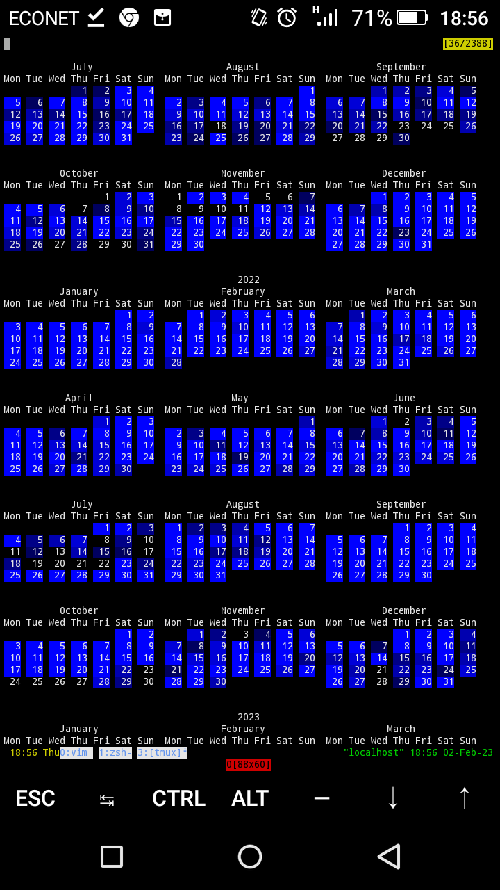

#pyGitCal.

PyGitCal is a python + C program for showing a terminal calendar just like that of ```cal```, with your git commits on days. Just like how github is attempting todo ;-)

#How to compile?
```sh
gcc call.c -lpython<VERSION> -I<path to headers of your python> -lgit2
```

#How to run?
```sh
./a.out ./calendar <path to repo>
```

#What to expect?
Something like:

